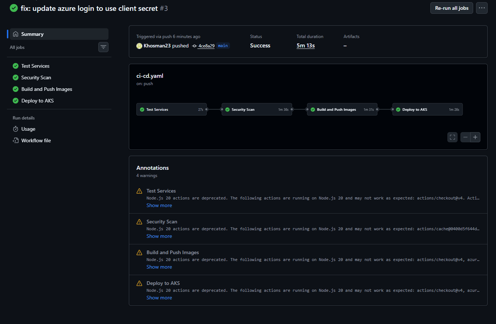
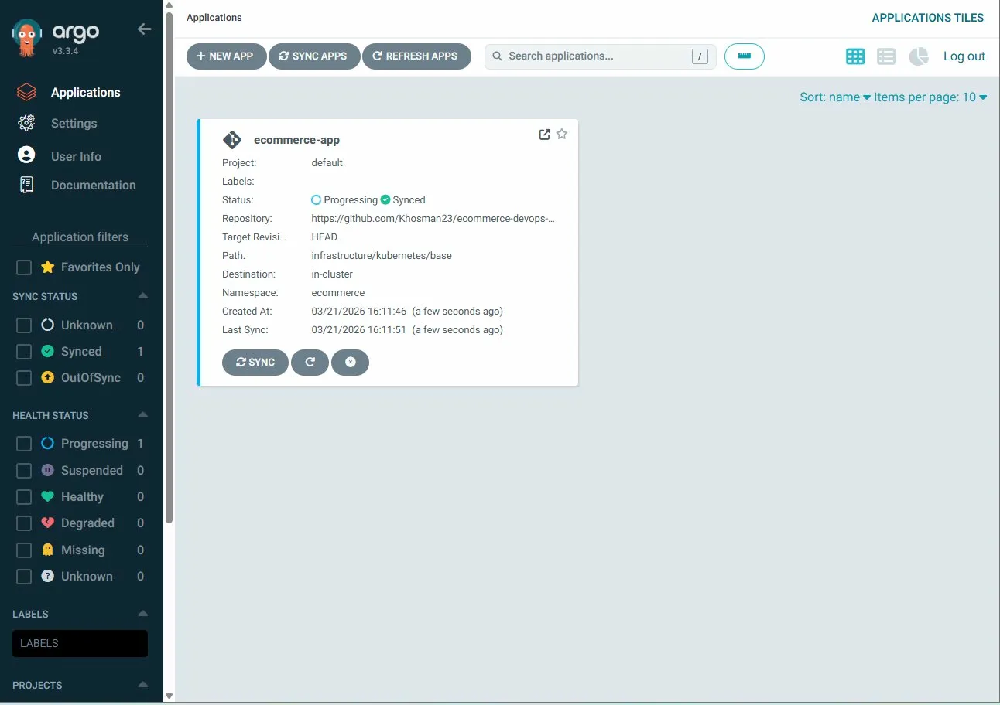
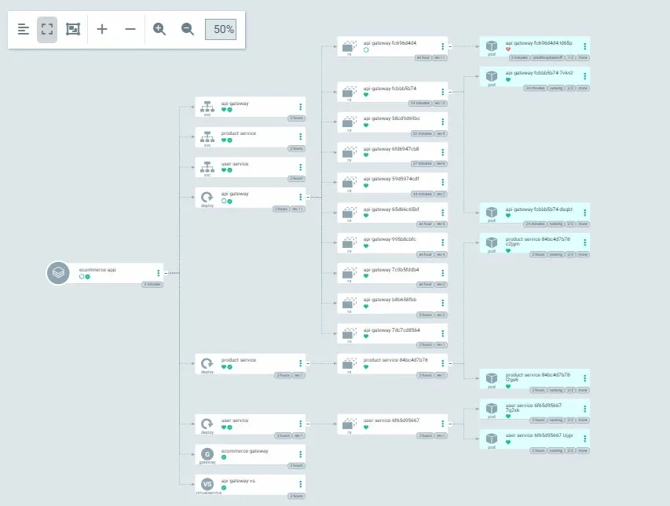
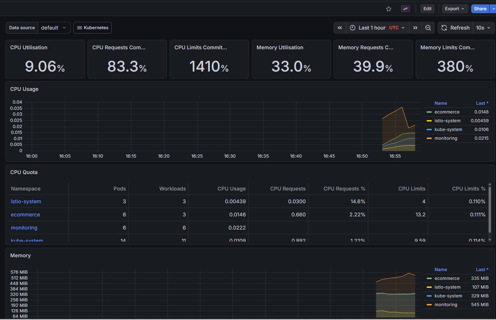
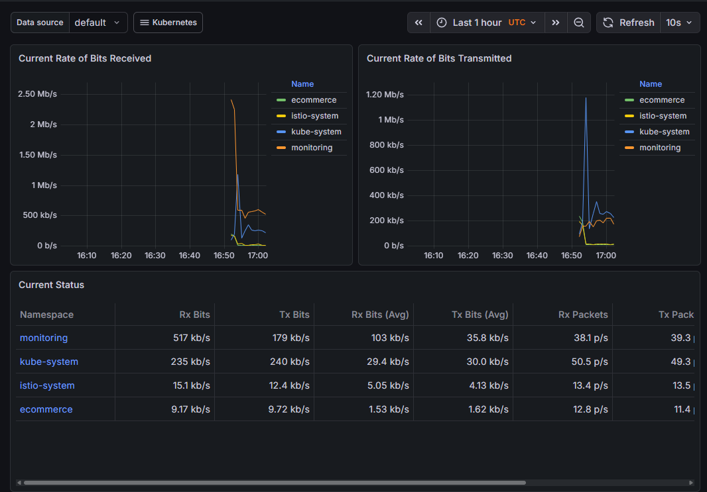

# E-Commerce DevOps Platform

A production-grade, multi-region e-commerce platform built to demonstrate senior-level DevOps engineering across the full stack.

**Live pipeline:** GitHub Actions → Docker → Azure Container Registry → AKS (West Europe + East US)

---

## Tech Stack

| Category | Tool |
|---|---|
| CI/CD | GitHub Actions |
| IaC | Azure Bicep |
| Cloud | Azure (AKS, ACR, Key Vault, VNet) |
| Containers | Docker |
| Orchestration | Kubernetes |
| Service Mesh | Istio |
| GitOps | ArgoCD |
| Security | Trivy |
| Monitoring | Prometheus + Grafana |
| Languages | Node.js, Python (FastAPI), Go |

---

## CI/CD Pipeline — All 4 Stages Green



Automated pipeline triggered on every push to main:
- **Test Services** — build verification for all three microservices
- **Security Scan** — Trivy vulnerability scanning on all Docker images
- **Build & Push** — images pushed to Azure Container Registry with commit SHA tag
- **Deploy to AKS** — rolling update to Kubernetes cluster with rollout verification

---

## GitOps with ArgoCD





ArgoCD watches the GitHub repository and automatically syncs any changes to the AKS cluster. The visual map shows all Deployments, ReplicaSets, Pods, Istio Gateway and VirtualService running in the ecommerce namespace.

---

## Live Monitoring — Prometheus + Grafana





Real-time metrics from the live AKS cluster showing CPU utilisation, memory usage per namespace, and network traffic across ecommerce, istio-system, monitoring and kube-system namespaces.

---

## Architecture

GitHub Repository
│
▼
GitHub Actions (Test → Scan → Build → Deploy)
│
▼
Azure Container Registry
│
▼
AKS West Europe          AKS East US
├── api-gateway           ├── api-gateway
├── user-service          ├── user-service
└── product-service       └── product-service
│
Istio Service Mesh
ArgoCD GitOps
Prometheus + Grafana

---

## Services

- **api-gateway** (Node.js) — Single public entry point, routes traffic to internal services
- **user-service** (Python/FastAPI) — User management REST API
- **product-service** (Go) — Product catalog, compiled to single binary via multi-stage Docker build

## Infrastructure (Bicep IaC)

All Azure infrastructure defined as code. Single command deploys everything:

```bash
az deployment sub create \
  --name "ecommerce-infrastructure" \
  --location "westeurope" \
  --template-file infrastructure/bicep/main.bicep
```

Provisions: 2x AKS clusters, Azure Container Registry, Key Vault, Virtual Networks across West Europe and East US.

---

**Author:** Khalid Hassan Osman